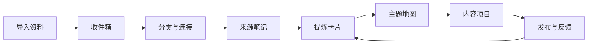

# 林的知识库

> 这不是资料仓库，而是一套把输入转化为理解、观点和作品的持续迭代系统。

## 今天从这里开始

1. 有新资料：放进[[01-收件箱/收件箱说明|收件箱]]。
2. 有 10 分钟：处理一条“待整理”资料，为它补主题与连接。
3. 有 30 分钟：从来源资料写一张[[03-提炼卡片/提炼中心|提炼卡片]]。
4. 准备创作：进入[[04-项目与输出/内容项目中心|内容项目中心]]组合观点。
5. 每周一次：完成[[05-复盘与迭代/知识库健康检查|知识库健康检查]]。

## 领域地图

- [[02-主题地图/沉香 MOC|沉香 MOC]]：知识、产业、文化、科研与《大地瑰宝》
- [[02-主题地图/修行 MOC|修行 MOC]]：经典、实践、身心成长与传统文化
- [[02-主题地图/自媒体 MOC|自媒体 MOC]]：平台、创作、AI、运营与商业化
- [[02-主题地图/跨领域连接 MOC|跨领域连接 MOC]]：把沉香、修行、自媒体组合成独特内容

## 工作台

- ![[99-系统/待处理资料.base#待整理与待提炼]]
- [[03-提炼卡片/提炼中心|提炼中心]]
- [[04-项目与输出/内容项目中心|内容项目中心]]
- [[05-复盘与迭代/本周复盘|本周复盘]]

## 知识流

## 系统说明

- [[00-知识库入口/知识库使用流程|知识库使用流程]]
- [[99-系统/属性规范|属性规范]]
- [[99-系统/链接规范|链接规范]]
- [[99-系统/知识库设计依据|知识库设计依据]]
